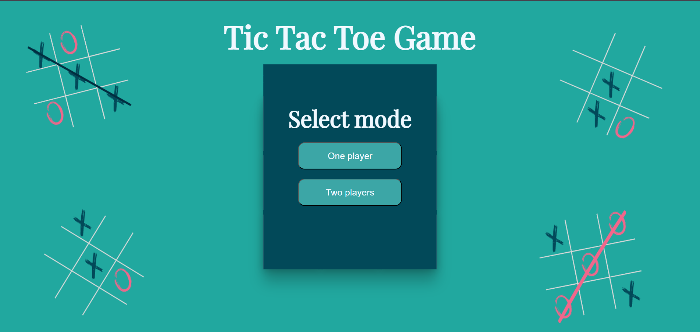
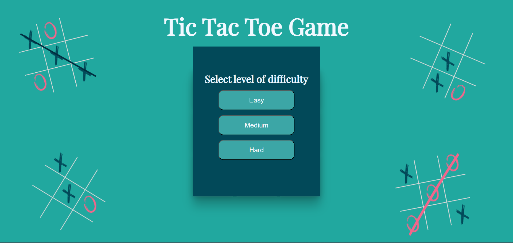
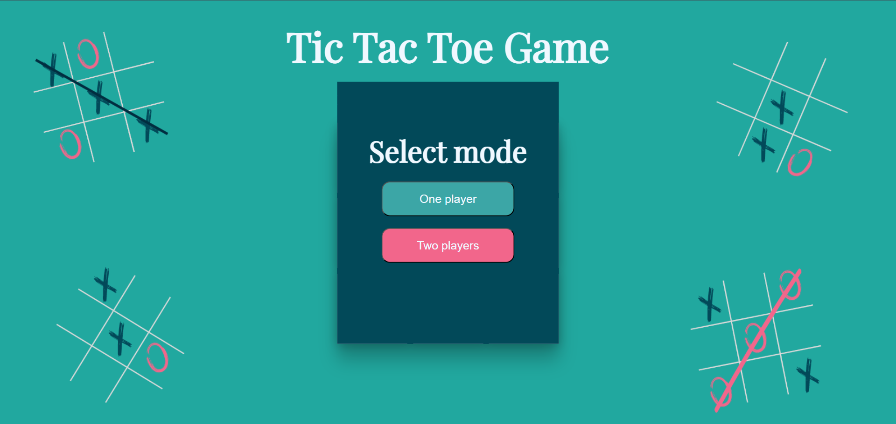
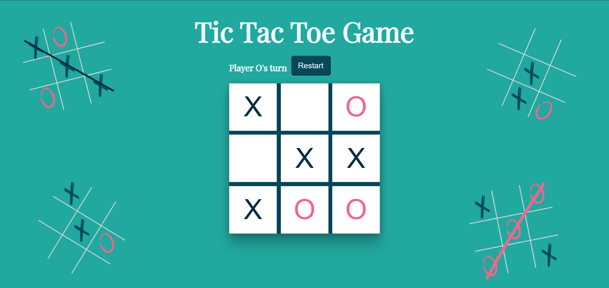

# 🎮 Tic Tac Toe Game (AI + JavaScript)

A web-based **Tic Tac Toe** game developed using **HTML, CSS, and JavaScript**, featuring both **Single-player (AI)** and **Two-player** modes.  


---

##  Features

-  **Single-player mode** with three difficulty levels:
  - Easy (limited AI depth)
  - Medium (moderate search depth)
  - Hard (full Alpha-Beta pruning AI)
-  **Two-player mode** (local play)
-  Restart and New Game options
-  Custom UI built with CSS and Google Fonts

---

##  Techniques Used

### 1. Front-End Development
- **HTML5** – Structure and layout of the game board  
- **CSS3** – Styling, custom fonts, and hover effects  
- **JavaScript (ES6)** – Game logic, AI implementation, and dynamic DOM updates  

### 2. Artificial Intelligence Concepts
- **Minimax Algorithm:**  
  The AI simulates all possible moves to choose the optimal one that maximizes its chance of winning.

- **Alpha-Beta Pruning:**  
  Optimizes the Minimax search by pruning branches that don’t affect the final decision, improving efficiency.

- **Difficulty Levels via Depth Limitation:**  
  Different game difficulties are implemented by controlling the search depth in the Minimax algorithm:
  - **Easy:** Depth = 2  
  - **Medium:** Depth = 5  
  - **Hard:** Depth = 10

### 3. Game Logic and UI Handling
- Dynamic turn display (Player X / Player O)
- Detection of all win/draw states
- Smooth reset and new game transitions
- Responsive board layout and button states

---

##  Project Structure

tic-tac-toe-ai/
│
├── index.html # Main game interface
├── style.css # Styling and layout
├── index.js # Game logic + AI implementation
└── miraDesign5.png # Background image

---

##  How to Run

1. **Clone the repository:**
   ```bash
   git clone https://github.com/mirajamous/TIC-TAC-TOE.git
    ```
2. Open index.html in your browser.

3. Select game mode and start playing!   
---
## Academic Context

This project was developed as part of my Artificial Intelligence course at university.
It demonstrates the application of search algorithms (Minimax & Alpha-Beta Pruning) in a practical and interactive setting.
Through this project, I learned:

* How to design an AI opponent using decision trees

* How to manage game state and user interaction on the web

* How to integrate AI logic into a front-end interface
---
## Preview





